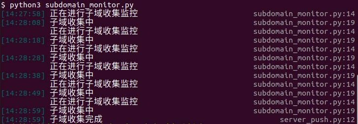
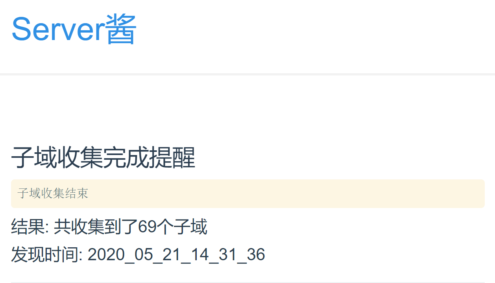

# AUTO-EARN
[](https://www.python.org/)


## 目录结构

```
│  app.py  //前台展示
│  autoearn.py  //程序入口
│  README.md
│  requirements.txt  
│  server.py  //漏洞推送、通知提醒
│  start.sh  //启动相关程序、日志记录
│  stop.sh
│  subdomain_monitor.py  //子域收集监控、数据库保存
│  target.txt  //目标文件
│  
├─lib //插件目录
│      check_cdn.py  //cdn检查模块
│      config.py  //配置模块
│      craw_to_xray.py  //爬虫、漏洞抓取模块
│      port_check.py  //端口检测模块
│      read_target.py  //目标读取模块
│      run_html.py  //前台启动模块
│      server_push.py  //消息通知模块
│      sql_connect.py  //数据库相关模块
│      subdomain_collect.py  //子域收集模块
│      waf_check.py  //waf检测模块
│      __init__.py
│      
├─logs
│      crawlergo.log  //crawlergo日志
│      oneforall.log  //oneforall日志
│      server.log  //漏洞推送日志
│      subdomain_monitor.log //子域收集监控日志
│      xray.log
│      
├─pic
│  └─README
│          
├─results
│      result.sqlite3  //数据库
│      
├─templates
│      index.html //主页文件
│      
└─tools
    ├  crawlergo  //一个使用chrome headless模式进行URL入口收集的动态爬虫
    ├  chrome  //chrome浏览器
    ├  masscan //异步传输，无状态的扫描端口工具             
    ├  OneForAll  //一款功能强大的子域收集工具                      
    ├  wafcheck  //WAF指纹识别工具             
    └  xray  //一款躺着收洞的神器
```


## 工具流程

`AUTO-EARN`是一个利用[OneForAll](https://github.com/shmilylty/OneForAll)进行子域收集、[Shodan API](https://www.shodan.io/?language=en)端口扫描、[Wafw00f](https://github.com/EnableSecurity/wafw00f)进行WAF指纹识别、[Xray](https://xray.cool/xray/)漏洞Fuzz、[Server酱](http://sc.ftqq.com/3.version)的自动化漏洞扫描、由`Flask`支撑一个简单可视化界面，即时通知提醒的漏洞挖掘辅助工具，本质上更像是一个流程框架，完成各工具之前的自动化联动过程，这个工具执行流程如下


首先通过`target.txt`读取到`目标`之后，由`OneForAll`后台进行子域名收集过程，然后通过`subdomain_monitor.py`进行监控，监测子域收集过程是否完成，完成后会通过`server酱`进行消息推送，并且存入本地数据库中的`SUBDOMAIN`表





在收集子域完成后，通过`端口检测`进行端口检测，目的是发现那些开放在其它端口上的`web`系统，从而能更全面的进行后续的检测，在端口检测过程中会首先通过`check_cdn.py`进行`CDN检测`，之后不存在`CDN`的目标再利用`shodan api`进行`端口检测`以及`服务识别`的过程，然后将检测到的目标按照`协议:DOMAIN:端口`的格式存储到`TASK`表中，如果目标存在`CDN`则默认返回`80`端口存储到`TASK`表中


之后`WAF检测`过程会对`TASK`中的每个目标通过`Wafw00f`进行指纹识别，并且修改`TASK`表中的`WAF`字段，这里大家可以根据自己的需求再进行更改，比如舍弃存在`WAF`的目标

`Fuzz`阶段会首先调用[crawlergo](https://github.com/0Kee-Team/crawlergo)使用`chrome headless`模式进行URL入口收集，我们可以利用`--push-to-proxy`来连接我们的被动扫描器[xray](https://github.com/chaitin/xray)进行漏洞扫描， `xray` 有一种漏洞输出模式叫 `webhook-output`，在发现漏洞的时候，将会向指定的 `url`以 `post`的方式传输漏洞数据，之后我们通过搭建一个 `web` 服务器，接收到 `xray` 发送的漏洞信息，然后在将它转发，我们借助于 `Python` 的 `flask` 框架构造了`server.py`，接下来就是解析 `xray` 的漏洞信息，然后生成对应的页面模板，之后通过`server酱`我们就可以将漏洞信息推送到我们的微信中


并且我们模板中的相应字段我们会存储在`VULN`表中

之后我们会利用`app.py`生成一个`index.html`，我们就可以通过`查看`功能来查看数据库内相应的字段，并且利用`Echarts`进行数据可视化过程


## 配置安装

### 手工安装

#### Python

由于`OneForAll`基于[Python 3.8.0](https://www.python.org/downloads/release/python-380/)开发和测试，请使用高于Python 3.8.0的稳定发行版本，其他版本可能会出现一些问题（Windows平台必须使用3.8.0以上版本），安装Python环境可以参考[Python 3 安装指南](https://pythonguidecn.readthedocs.io/zh/latest/starting/installation.html#python-3)。运行以下命令检查Python和pip3版本：

```
python -V
pip3 -V
```

如果你看到以下类似输出便说明Python环境没有问题：

```
Python 3.8.0
pip 19.2.2 from C:\Users\shmilylty\AppData\Roaming\Python\Python38\site-packages\pip (python 3.8)
```

#### Git克隆部署

```
git clone https://github.com/Echocipher/AUTO-EARN
```

#### 依赖安装

```
cd AUTO-EARN/
python3 -m pip install -U pip setuptools wheel -i https://mirrors.aliyun.com/pypi/simple/
pip3 install -r requirements.txt -i https://mirrors.aliyun.com/pypi/simple/
```

